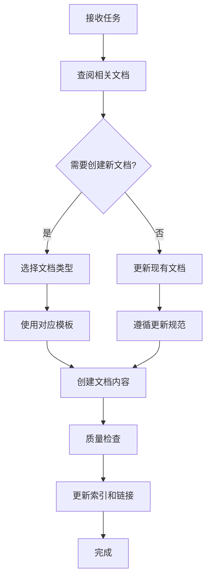
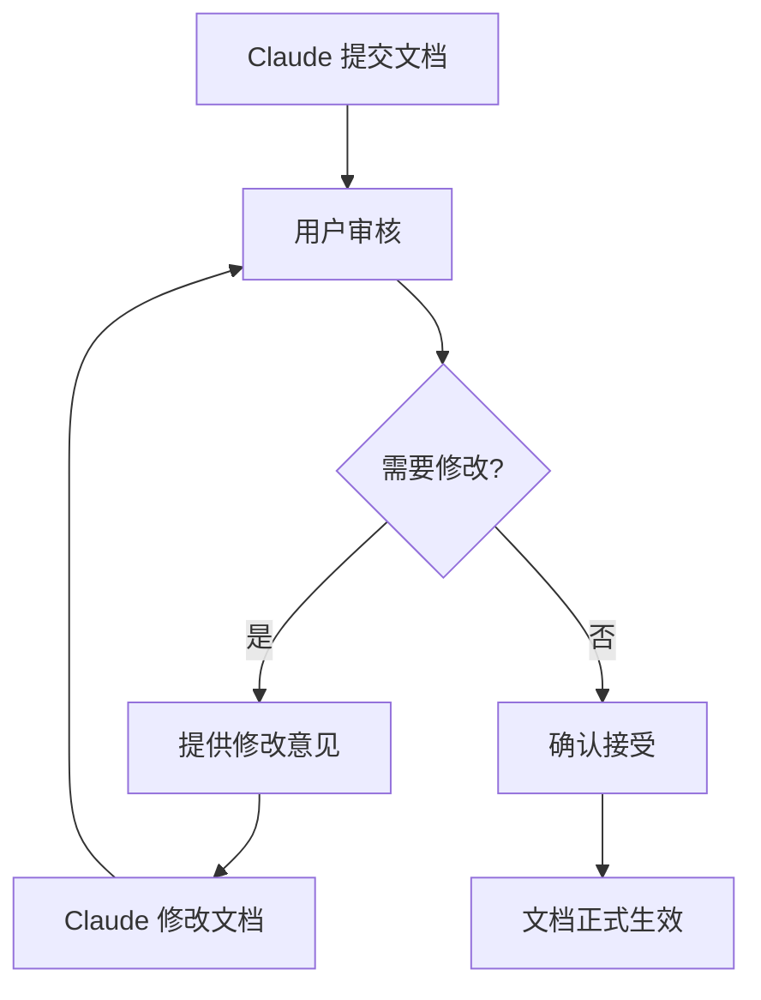

# Atlas 文档体系规范

> 定义 Atlas 项目的文档分类、使用规则和管理体系，确保 Claude 在开发过程中保持文档的清晰性和一致性。

---

## 1. 文档分类体系

### 1.1 只增文档 (Accumulative Documents)

**特征**：内容只添加，不删除或修改历史内容，记录决策过程和演进轨迹。

#### 🏗️ 技术架构与演进
```
docs/tech/
├── architecture-decisions.md          # 架构决策记录
├── tech-architecture.md              # 当前技术架构（可更新）
├── architecture-questions.md         # 架构问题与回答
├── migration-plans/                  # 迁移计划
│   ├── mvp-to-growth.md
│   └── growth-to-scale.md
└── tech-experiments/                 # 技术实验记录
    ├── llm-benchmarks.md
    └── storage-tests.md
```

#### 📋 合规与准则
```
docs/guidelines/
├── atlas_技术与合规实施准则.md        # 核心准则（只增修订历史）
├── compliance-checklist.md           # 合规检查清单
├── security-policies.md              # 安全策略
└── data-governance-rules.md          # 数据治理规则
```

#### 📚 知识库与最佳实践
```
docs/knowledge/
├── best-practices/                   # 最佳实践
│   ├── python-coding-standards.md
│   ├── llm-usage-patterns.md
│   └── data-collection-strategies.md
├── references/                       # 参考资料
│   ├── external-docs.md
│   └── tool-documentation.md
└── lessons-learned/                  # 经验教训
    ├── pitfalls-to-avoid.md
    └── optimization-tips.md
```

### 1.2 可变更文档 (Mutable Documents)

**特征**：需要定期更新，反映当前状态和最新信息。

#### 📊 项目状态与进度
```
docs/project/
├── README.md                         # 项目概览（定期更新）
├── roadmap.md                       # 发展路线图
├── milestones/                      # 里程碑跟踪
│   ├── mvp-progress.md
│   ├── current-sprint.md
│   └── completed-features.md
└── status/                          # 状态报告
    ├── weekly-reports/
    └── monthly-summary.md
```

#### ✅ TODO 列表与任务管理
```
docs/tasks/
├── current-backlog.md               # 当前待办事项
├── bug-reports.md                   # Bug 报告
├── feature-requests.md              # 功能需求
└── quick-tasks.md                   # 快速任务清单
```

#### 📖 使用文档与指南
```
docs/usage/
├── installation-guide.md            # 安装指南
├── user-manual.md                   # 用户手册
├── developer-guide.md               # 开发者指南
├── deployment-guide.md              # 部署指南
└── troubleshooting.md               # 故障排除
```

#### 📇 文档索引与导航
```
docs/
├── README.md                        # 文档索引（可变更）
├── sitemap.md                       # 文档地图
├── quick-start.md                   # 快速开始
└── changelog.md                     # 变更日志
```

### 1.3 开发日志文档 (Development Logs)

**特征**：记录开发过程、变更历史和测试结果。

#### 📝 变更与开发日志
```
docs/dev/
├── changelogs/                      # 详细变更记录
│   ├── 2024-12/
│   └── 2025-01/
├── claude-logs/                     # Claude 操作日志
│   ├── session-summaries.md
│   └── major-changes.md
├── testing/                         # 测试文档
│   ├── test-results.md
│   ├── performance-tests.md
│   └── integration-tests.md
└── research/                        # 研究记录
    ├── tech-investigations.md
    └── prototype-experiments.md
```

---

## 2. Claude 文档使用规则

### 2.1 文档操作权限矩阵

| 文档类型 | 创建 | 读取 | 更新 | 删除 | 备注 |
|---------|------|------|------|------|------|
| **只增文档** | ✅ | ✅ | ⚠️ | ❌ | 只能追加内容 |
| **可变更文档** | ✅ | ✅ | ✅ | ⚠️ | 需要遵循更新规范 |
| **开发日志** | ✅ | ✅ | ✅ | ❌ | 按时间序列组织 |

### 2.2 文档更新规范

#### 📝 只增文档更新规则

```markdown
## 更新规范

### 新增内容格式
```markdown
### [YYYY-MM-DD] 更新标题

**更新人**：Claude Sonnet / 用户
**更新类型**：新增/修正/补充

**内容**：
[具体更新内容]

**影响范围**：
- [x] 架构设计
- [ ] 实施计划
- [ ] 合规要求

**相关文档**：
- [链接到相关文档]
```

**禁止操作**：
- ❌ 修改历史内容
- ❌ 删除已有章节
- ❌ 改变原文结构
```

#### 🔄 可变更文档更新规则

```markdown
## 更新规范

### 版本控制
```markdown
<!-- 文档头部版本信息 -->
---
version: "1.2.0"
last_updated: "2025-01-17"
updated_by: "Claude Sonnet"
changelog:
  - "更新了 MVP 实施指南"
  - "调整了技术选型"
---
```

**更新要求**：
- ✅ 更新版本号
- ✅ 记录变更日志
- ✅ 保持历史版本备份
- ✅ 通知相关变更影响
```

### 2.3 Claude 操作检查清单

在创建或更新任何文档前，Claude 必须：

#### 📋 创建新文档检查清单
- [ ] 确认文档分类（只增/可变更/开发日志）
- [ ] 选择正确的目录路径
- [ ] 使用文档模板
- [ ] 添加必要的元信息
- [ ] 更新相关索引文档

#### ✏️ 更新文档检查清单
- [ ] 确认文档类型和更新权限
- [ ] 检查是否影响其他文档
- [ ] 遵循对应的更新规范
- [ ] 更新版本信息和变更日志
- [ ] 更新相关引用和链接

---

## 3. 文档模板体系

### 3.1 只增文档模板

```markdown
# [文档标题]

> 文档描述和目的

**创建时间**：YYYY-MM-DD
**创建人**：Claude Sonnet / 用户
**文档类型**：只增文档
**所属分类**：技术架构/合规准则/知识库

---

## 内容结构

### [初始章节]

**更新历史**：
- [YYYY-MM-DD] 初始创建 - [简要说明]

---

## 相关链接

- [相关文档链接]
```

### 3.2 可变更文档模板

```markdown
---
version: "1.0.0"
last_updated: "2025-01-17"
updated_by: "Claude Sonnet"
document_type: "mutable"
category: "usage_guide"
---

# [文档标题]

> 文档描述和目的

---

## 内容

### [章节标题]

[内容]

---

## 变更日志

### v1.0.0 (2025-01-17)
- 初始版本创建
```

### 3.3 开发日志模板

```markdown
# [日期] 开发日志

**日期**：YYYY-MM-DD
**开发者**：Claude Sonnet
**会话ID**：[会话标识]
**主要任务**：[任务描述]

---

## 今日完成

### ✅ 主要成果
- [完成的任务或功能]

### 📝 技术决策
- [技术选择和理由]

### 🔧 代码变更
- [主要代码变更]

---

## 遇到的问题

### ⚠️ 问题和解决方案
- [问题描述和解决方法]

### 🤔 待解决问题
- [未解决的问题]

---

## 明日计划

- [明日计划任务]
```

---

## 4. 文档命名规范

### 4.1 文件命名规则

#### 只增文档
- 格式：`kebab-case.md`
- 示例：`architecture-decisions.md`, `compliance-checklist.md`

#### 可变更文档
- 格式：`simple-name.md`
- 示例：`README.md`, `roadmap.md`, `installation-guide.md`

#### 开发日志
- 格式：`YYYY-MM-DD-description.md`
- 示例：`2025-01-17-mvp-implementation.md`

### 4.2 目录命名规则

- 使用小写字母和连字符
- 保持简洁明了
- 单数形式（例外：docs, tests, logs）

```
docs/
├── tech/                    # 技术文档
├── guidelines/              # 准则文档
├── project/                 # 项目文档
├── usage/                   # 使用文档
├── dev/                     # 开发文档
└── tasks/                   # 任务文档
```

---

## 5. 文档链接管理

### 5.1 内部链接规范

```markdown
# 相对链接示例
[技术架构](tech/tech-architecture.md)
[安装指南](usage/installation-guide.md)

# 锚点链接示例
[架构决策](architecture-decisions.md#mvp-阶段决策)

# 目录索引链接
[文档索引](README.md#文档分类)
```

### 5.2 外部链接规范

```markdown
# 带标题的外部链接
[Python 官方文档](https://docs.python.org/3/ "Python 3.13 文档")

# 参考资料格式
- **来源**：[文章标题](链接)
- **作者**：作者名称
- **日期**：发布日期
```

---

## 6. 质量保证机制

### 6.1 文档审查清单

在提交文档前，Claude 应该：

#### ✅ 内容质量检查
- [ ] 内容准确无误
- [ ] 结构清晰合理
- [ ] 语言简洁明了
- [ ] 链接有效可访问

#### 📋 格式规范检查
- [ ] 遵循 Markdown 规范
- [ ] 使用正确的模板
- [ ] 元信息完整
- [ ] 命名规范正确

#### 🔗 关联性检查
- [ ] 更新相关索引
- [ ] 检查引用链接
- [ ] 通知相关变更
- [ ] 保持文档一致性

### 6.2 定期维护任务

#### 📅 每周任务
- 检查链接有效性
- 更新过时信息
- 整理开发日志

#### 📅 每月任务
- 文档结构优化
- 模板更新
- 归档旧日志

#### 📅 每季度任务
- 文档体系审查
- 分类标准调整
- 使用效率分析

---

## 7. 文档使用工作流

### 7.1 Claude 开发工作流



### 7.2 用户审核工作流



---

## 8. 紧急情况处理

### 8.1 文档冲突处理

**发现文档冲突时**：
1. 立即停止操作
2. 创建冲突记录
3. 通知用户决策
4. 根据决策执行

### 8.2 文档损坏处理

**发现文档损坏时**：
1. 从版本控制恢复
2. 分析损坏原因
3. 修复文档结构
4. 加强检查机制

### 8.3 信息不一致处理

**发现信息不一致时**：
1. 标记不一致内容
2. 查找权威信息源
3. 更新相关文档
4. 记录修正历史

---

## 9. 总结

本文档体系规范确保：

### ✅ 目标达成
- **文档清晰性**：分类明确，结构清晰
- **信息一致性**：统一规范，避免冲突
- **可维护性**：规则明确，易于管理
- **可追溯性**：记录完整，历史可查

### 🎯 核心原则
- **分类管理**：按文档类型制定不同规则
- **权限控制**：明确 Claude 的操作权限
- **质量保证**：多重检查机制
- **持续改进**：定期优化和调整

通过这套文档体系，Claude 可以在保持高效开发的同时，确保文档的清晰性、一致性和可维护性。