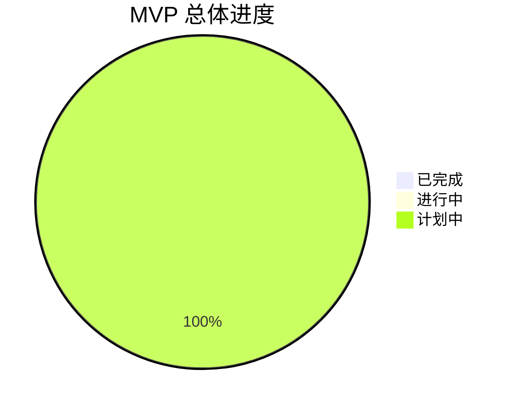
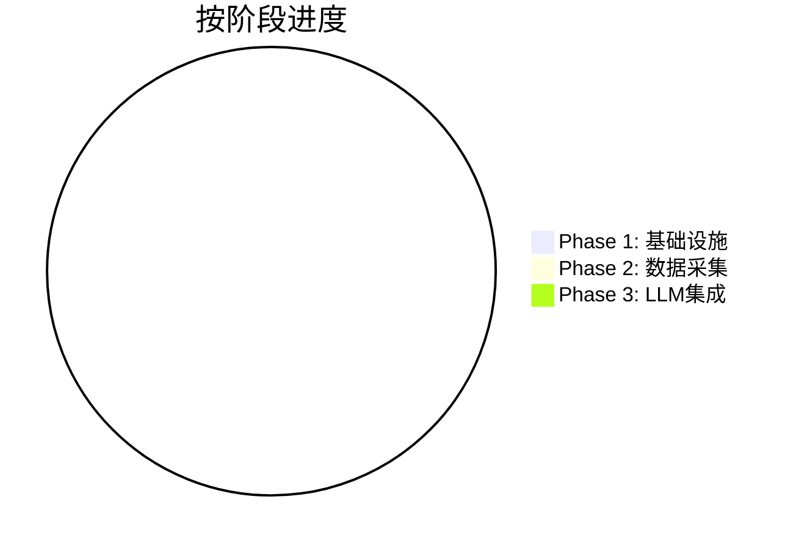
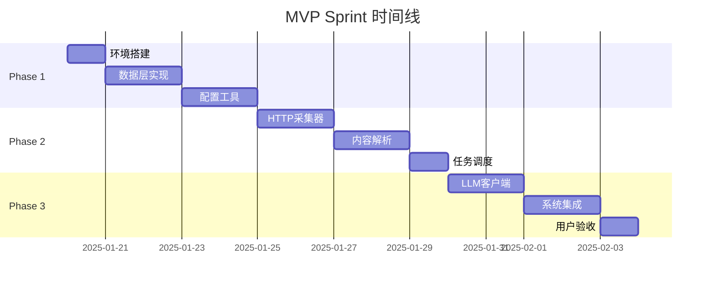

# Atlas MVP Sprint 当前进度

> MVP 开发第一周进度跟踪和里程碑管理

---

## 文档信息

- **Sprint 名称**：MVP Phase 1 - 基础设施
- **Sprint 周期**：2025-01-20 至 2025-02-07 (3周)
- **当前状态**：🟡 准备中
- **完成度**：0%

---

## 🎯 Sprint 目标

### 主要目标
构建 Atlas MVP 的基础架构和核心功能，实现稳定的数据采集和基础处理能力。

### 成功标准
- ✅ 完成所有 P0 关键路径任务
- ✅ 系统可稳定运行 24 小时
- ✅ 数据采集功能正常
- ✅ 本地 LLM 去重功能有效

### 交付物
- 可运行的 MVP 系统
- 完整的部署文档
- 用户使用指南
- 测试报告

---

## 📊 进度概览

### 整体进度


### 按阶段进度


### 时间线进度


---

## 📅 本周计划 (Week 1: 2025-01-20 ~ 2025-01-24)

### 周目标
完成基础设施搭建，为数据采集功能奠定基础。

### 每日任务

#### Day 1 - 2025-01-20 (周一)
**主题**：环境搭建与项目初始化

```yaml
daily_tasks:
  - task_id: "TASK-001"
    title: "环境搭建与项目初始化"
    priority: "P0"
    estimated_hours: 4
    status: "⏳ 计划中"

key_deliverables:
  - Python 3.13 + uv 环境配置
  - 项目目录结构
  - 基础配置文件
  - 日志系统

acceptance_criteria:
  - [ ] 项目可正常启动
  - [ ] 依赖安装成功
  - [ ] 日志系统正常工作
  - [ ] 配置文件可正常读取

risks:
  - Python 版本兼容性问题
  - 依赖安装失败
```

#### Day 2-3 - 2025-01-21~22 (周二-周三)
**主题**：数据库与存储层实现

```yaml
daily_tasks:
  - task_id: "TASK-002"
    title: "数据库与存储层实现"
    priority: "P0"
    estimated_hours: 8
    status: "⏳ 计划中"

key_deliverables:
  - SQLite 数据库设计
  - JSON 文件存储系统
  - 数据模型定义
  - 基础 CRUD 操作

acceptance_criteria:
  - [ ] 数据库可正常创建和连接
  - [ ] 基础数据模型定义完成
  - [ ] CRUD 操作测试通过
  - [ ] JSON 存储系统工作正常

risks:
  - 数据库设计不合理
  - 存储性能问题
```

#### Day 4-5 - 2025-01-23~24 (周四-周五)
**主题**：配置管理与开发工具

```yaml
daily_tasks:
  - task_id: "TASK-003"
    title: "配置管理与开发工具"
    priority: "P1"
    estimated_hours: 8
    status: "⏳ 计划中"

key_deliverables:
  - 配置文件管理
  - 命令行工具
  - 基础测试框架
  - 开发脚本

acceptance_criteria:
  - [ ] 配置文件可正常解析
  - [ ] CLI 工具功能完整
  - [ ] 测试框架可正常运行
  - [ ] 开发脚本工作正常

risks:
  - 配置系统过于复杂
  - CLI 功能不够完整
```

---

## 🎯 关键里程碑

### Milestone 1: 基础设施完成 (2025-01-24)
**状态**：⏳ 计划中
**完成度**：0%

```yaml
success_criteria:
  - [ ] 开发环境完全配置
  - [ ] 数据库和存储系统可用
  - [ ] 配置管理工具完成
  - [ ] 基础测试框架就绪

deliverables:
  - 可运行的项目骨架
  - 数据库初始化脚本
  - 配置文件模板
  - CLI 工具

next_steps:
  - 开始数据采集器开发
  - 准备测试数据源
  - 设置持续集成
```

### Milestone 2: 数据采集完成 (2025-01-31)
**状态**：⏳ 计划中
**完成度**：0%

```yaml
success_criteria:
  - [ ] HTTP 采集器工作正常
  - [ ] RSS 解析功能完成
  - [ ] 内容解析器有效
  - [ ] 任务调度系统可用

deliverables:
  - 数据采集器
  - 内容处理器
  - 任务调度器
  - 集成测试

next_steps:
  - 集成本地 LLM
  - 实现智能去重
  - 性能优化
```

### Milestone 3: MVP 完成 (2025-02-07)
**状态**：⏳ 计划中
**完成度**：0%

```yaml
success_criteria:
  - [ ] 本地 LLM 集成完成
  - [ ] 智能去重功能有效
  - [ ] 系统稳定运行 24 小时
  - [ ] 用户验收测试通过

deliverables:
  - 完整 MVP 系统
  - 用户文档
  - 部署指南
  - 测试报告

next_steps:
  - 准备 Growth 阶段
  - 收集用户反馈
  - 规划下一版本
```

---

## ⚠️ 风险与问题

### 当前风险
| 风险 | 概率 | 影响 | 应对措施 | 状态 |
|------|------|------|----------|------|
| 环境配置问题 | 中 | 高 | 提前验证，准备备选方案 | ⏳ 监控中 |
| 依赖安装失败 | 中 | 中 | 使用国内镜像，离线安装包 | ⏳ 监控中 |
| 数据库设计问题 | 低 | 高 | 简化设计，参考成熟方案 | ⏳ 监控中 |

### 当前问题
- 无当前问题

### 已解决问题
- 无已解决问题

---

## 📈 性能指标

### 开发效率指标
- **代码行数**：0 / 5,000 (目标)
- **测试覆盖率**：0% / 80% (目标)
- **文档完整度**：0% / 90% (目标)
- **任务完成率**：0% / 100% (目标)

### 质量指标
- **Bug 数量**：0
- **代码审查通过率**：N/A
- **集成测试通过率**：N/A
- **用户验收通过率**：N/A

### 资源使用指标
- **开发工时**：0 / 60 小时 (计划)
- **内存使用**：N/A
- **CPU 使用**：N/A
- **存储使用**：N/A

---

## 🔄 每日站会记录

### 2025-01-17 (计划会议)
**参与者**：Claude Sonnet

**会议内容**：
- 确定 MVP 开发计划
- 拆解开发任务
- 制定时间表
- 识别风险点

**决议**：
- 采用 3 周开发计划
- 优先完成核心功能
- 重视测试和文档

**后续行动**：
- 创建任务清单
- 准备开发环境
- 开始 Day 1 任务

---

## 📝 学习与改进

### 本周学习重点
1. **Python 3.13 新特性**：异步性能优化
2. **SQLite 高级用法**：FTS5 全文检索
3. **uv 依赖管理**：最佳实践
4. **测试驱动开发**：TDD 方法

### 改进措施
1. **代码质量**：增加代码审查环节
2. **文档维护**：及时更新开发文档
3. **测试覆盖**：确保每个模块有测试
4. **性能监控**：建立性能基准测试

---

## 📋 下周计划预告

### Week 2 计划 (2025-01-27 ~ 2025-01-31)
**主题**：数据采集功能实现

**主要任务**：
- TASK-004: HTTP 客户端与基础采集器
- TASK-005: 内容解析与数据处理
- TASK-006: 任务调度系统

**重点目标**：
- 实现稳定的数据采集
- 完成内容解析功能
- 建立任务调度机制

---

## 📞 联系方式与支持

### 项目团队
- **开发者**：Claude Sonnet
- **项目经理**：用户
- **测试负责人**：用户

### 沟通渠道
- **日常沟通**：直接对话
- **问题报告**：创建 Issue
- **进度同步**：每日更新文档

### 支持资源
- **技术文档**：[docs/](../README.md)
- **问题跟踪**：[docs/tasks/bug-reports.md](../tasks/bug-reports.md)
- **架构设计**：[docs/tech/tech-architecture.md](../tech/tech-architecture.md)

---

## 变更日志

### v1.0.0 (2025-01-17)
**更新人**：Claude Sonnet

**新增内容**：
- 创建 MVP Sprint 进度文档
- 制定 3 周开发计划
- 定义关键里程碑
- 建立进度跟踪机制

**改进优化**：
- 基于 MVP 计划的详细拆解
- 包含风险识别和应对措施
- 提供每日工作指导

**影响范围**：
- MVP 开发进度管理
- 团队协作方式
- 质量保证标准

**注意事项**：
- 需要每日更新进度状态
- 及时识别和处理风险
- 保持与用户沟通

---

## 文档状态

- **当前版本**：v1.0.0
- **下次更新**：每日更新进度
- **维护状态**：活跃维护
- **质量评级**：⭐⭐⭐⭐⭐

---

*本文档遵循 [Atlas 文档体系规范](../documentation-system.md)*