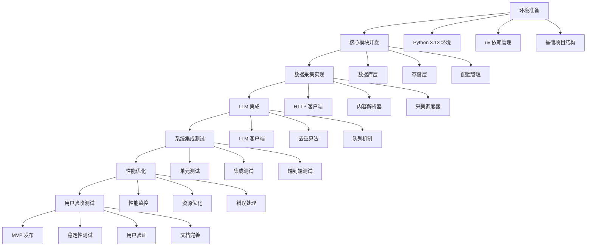
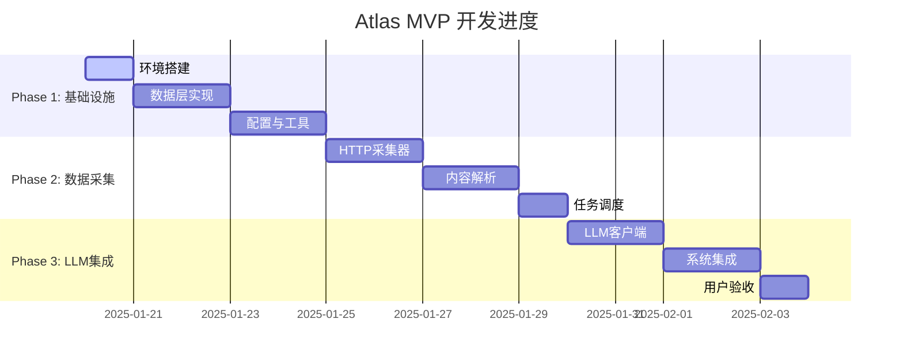

# Atlas MVP 开发计划

> MVP 版本开发的工作流、任务拆解和进度计划，确保 3 周内完成可验证的系统。

---

## 文档信息

- **创建时间**：2025-01-17
- **创建人**：Claude Sonnet
- **文档类型**：可变更文档
- **适用版本**：Atlas v0.1.0 MVP
- **预计工期**：3 周 (15 个工作日)

---

## MVP 阶段目标与范围

### 🎯 核心目标

**主要目标**：构建一个可稳定运行的个人信息聚合系统 MVP，验证核心理念和架构。

**成功标准**：
- ✅ 稳定运行 24 小时无崩溃
- ✅ 成功采集到用户认可的有效信息
- ✅ 去重准确率 > 80%
- ✅ 内存使用 < 2GB，CPU 使用 < 50%

### 📊 MVP 功能范围

#### 包含功能
- [x] 基础数据采集（RSS/HTTP）
- [x] JSON 文件存储
- [x] SQLite 数据存储
- [x] 本地 LLM 去重
- [x] 基础检索功能
- [x] cron 任务调度
- [x] 错误日志记录

#### 不包含功能
- [ ] Web 管理界面
- [ ] 复杂的数据处理管道
- [ ] 分布式架构
- [ ] 用户认证系统
- [ ] 实时数据流
- [ ] 高级分析功能

### 🏗️ 技术栈约束

```yaml
MVP_Stack:
  Runtime:
    - Python 3.13.x
    - Linux (Ubuntu/Fedora compatible)

  Dependencies:
    - uv (dependency manager)
    - Minimal external libraries

  Storage:
    - SQLite 3.45+ (database)
    - JSON files (raw data)

  Processing:
    - Beautiful Soup (HTML parsing)
    - Local LLM (Ollama + Qwen2.5-7B)

  Scheduling:
    - cron jobs
    - Simple lock mechanisms

  Explicit_Excluded:
    - Redis, PostgreSQL, OpenSearch
    - Docker, Kubernetes
    - Complex frameworks
```

---

## MVP 开发工作流

### 🔄 开发流程



### 📋 开发阶段

#### Phase 1: 基础设施 (第1周)
**目标**：搭建核心框架和基础设施

#### Phase 2: 数据采集 (第2周)
**目标**：实现数据采集和基础处理

#### Phase 3: LLM 集成 (第3周)
**目标**：集成 LLM 功能和系统优化

### 🎯 每日工作流

#### 开发前准备
1. 查看当前 TODO 列表
2. 确认今日开发任务
3. 检查相关文档更新

#### 开发过程
1. 创建/更新开发日志
2. 实现功能代码
3. 编写测试用例
4. 更新相关文档

#### 开发后整理
1. 提交代码变更
2. 更新进度状态
3. 记录问题和解决方案

---

## MVP 任务拆解

### 📅 Phase 1: 基础设施 (第1周)

#### Day 1: 环境与项目结构
```yaml
Task_1_1:
  title: "环境搭建与项目初始化"
  estimated_hours: 4
  priority: "High"

  subtasks:
    - name: "Python 3.13 + uv 环境配置"
      files: ["pyproject.toml", ".env.example"]
    - name: "项目目录结构创建"
      files: ["src/", "data/", "config/", "logs/"]
    - name: "基础配置管理"
      files: ["src/core/config.py"]
    - name: "日志系统初始化"
      files: ["src/core/logging.py"]

  deliverables:
    - 可运行的项目骨架
    - 基础配置文件
    - 开发环境验证脚本
```

#### Day 2-3: 数据层实现
```yaml
Task_1_2:
  title: "数据库与存储层实现"
  estimated_hours: 8
  priority: "High"

  subtasks:
    - name: "SQLite 数据库设计"
      files: ["src/core/database.py", "migrations/"]
    - name: "JSON 文件存储系统"
      files: ["src/core/storage.py"]
    - name: "数据模型定义"
      files: ["src/models/"]
    - name: "基础 CRUD 操作"
      files: ["src/core/operations.py"]

  deliverables:
    - 完整的数据访问层
    - 数据库初始化脚本
    - 存储系统测试
```

#### Day 4-5: 配置与工具
```yaml
Task_1_3:
  title: "配置管理与开发工具"
  estimated_hours: 8
  priority: "Medium"

  subtasks:
    - name: "配置文件管理"
      files: ["config/sources.yaml", "config/config.yaml"]
    - name: "命令行工具"
      files: ["src/cli.py"]
    - name: "基础测试框架"
      files: ["tests/conftest.py", "tests/test_core/"]
    - name: "开发脚本"
      files: ["scripts/"]

  deliverables:
    - 完整的配置系统
    - CLI 工具
    - 测试框架
```

### 📅 Phase 2: 数据采集 (第2周)

#### Day 6-7: HTTP 客户端与基础采集
```yaml
Task_2_1:
  title: "HTTP 客户端与基础采集器"
  estimated_hours: 8
  priority: "High"

  subtasks:
    - name: "HTTP 客户端封装"
      files: ["src/collectors/http_client.py"]
    - name: "基础采集器抽象类"
      files: ["src/collectors/base.py"]
    - name: "RSS 采集器"
      files: ["src/collectors/rss.py"]
    - name: "频率控制机制"
      files: ["src/collectors/rate_limiter.py"]

  deliverables:
    - 可用的数据采集器
    - RSS 解析功能
    - 访问频率控制
```

#### Day 8-9: 内容解析与处理
```yaml
Task_2_2:
  title: "内容解析与数据处理"
  estimated_hours: 8
  priority: "High"

  subtasks:
    - name: "HTML 内容提取"
      files: ["src/processors/parser.py"]
    - name: "文本清理与标准化"
      files: ["src/processors/normalizer.py"]
    - name: "基础去重算法"
      files: ["src/processors/dedup_base.py"]
    - name: "数据验证器"
      files: ["src/processors/validator.py"]

  deliverables:
    - 内容解析器
    - 数据标准化功能
    - 基础去重机制
```

#### Day 10: 任务调度系统
```yaml
Task_2_3:
  title: "任务调度与队列系统"
  estimated_hours: 4
  priority: "Medium"

  subtasks:
    - name: "cron 任务封装"
      files: ["src/scheduler/cron_manager.py"]
    - name: "简单任务队列"
      files: ["src/scheduler/queue.py"]
    - name: "任务状态管理"
      files: ["src/scheduler/status.py"]
    - name: "调度脚本"
      files: ["scripts/cron_job.py"]

  deliverables:
    - 可用的任务调度系统
    - 简单队列机制
    - cron 脚本
```

### 📅 Phase 3: LLM 集成 (第3周)

#### Day 11-12: 本地 LLM 集成
```yaml
Task_3_1:
  title: "本地 LLM 客户端与去重"
  estimated_hours: 8
  priority: "High"

  subtasks:
    - name: "Ollama 客户端封装"
      files: ["src/llm/local_client.py"]
    - name: "LLM 去重算法"
      files: ["src/processors/dedup_llm.py"]
    - name: "任务队列管理"
      files: ["src/llm/queue_manager.py"]
    - name: "降速控制机制"
      files: ["src/llm/adaptive_controller.py"]

  deliverables:
    - 本地 LLM 集成
    - 智能去重功能
    - 自适应控制机制
```

#### Day 13-14: 系统集成与优化
```yaml
Task_3_2:
  title: "系统集成与性能优化"
  estimated_hours: 8
  priority: "High"

  subtasks:
    - name: "端到端集成测试"
      files: ["tests/integration/"]
    - name: "性能监控工具"
      files: ["src/monitoring/performance.py"]
    - name: "错误处理增强"
      files: ["src/core/error_handler.py"]
    - name: "资源使用优化"
      files: ["src/core/resource_manager.py"]

  deliverables:
    - 完整集成测试
    - 性能监控工具
    - 错误处理机制
```

#### Day 15: 用户验收与文档
```yaml
Task_3_3:
  title: "用户验收测试与文档完善"
  estimated_hours: 4
  priority: "Medium"

  subtasks:
    - name: "用户验收测试"
      files: ["tests/user_acceptance/"]
    - name: "用户使用文档"
      files: ["docs/usage/user-manual.md"]
    - name: "部署指南"
      files: ["docs/usage/deployment-guide.md"]
    - name: "故障排除文档"
      files: ["docs/usage/troubleshooting.md"]

  deliverables:
    - 用户验收测试报告
    - 完整用户文档
    - MVP 发布包
```

---

## 进度计划与时间表

### 📊 总体进度



### 📋 每日进度跟踪

#### Week 1 进度表
| 日期 | 任务 | 状态 | 完成度 | 备注 |
|------|------|------|--------|------|
| Day 1 | 环境搭建与项目初始化 | ⏳ 计划中 | 0% | Python 3.13 + uv |
| Day 2 | 数据库层实现 | ⏳ 计划中 | 0% | SQLite 设计 |
| Day 3 | 存储层实现 | ⏳ 计划中 | 0% | JSON 文件系统 |
| Day 4 | 配置管理 | ⏳ 计划中 | 0% | 配置文件管理 |
| Day 5 | 开发工具与测试 | ⏳ 计划中 | 0% | CLI + 测试框架 |

#### Week 2 进度表
| 日期 | 任务 | 状态 | 完成度 | 备注 |
|------|------|------|--------|------|
| Day 6 | HTTP 客户端 | ⏳ 计划中 | 0% | 基础采集器 |
| Day 7 | RSS 采集器 | ⏳ 计划中 | 0% | RSS 解析 |
| Day 8 | 内容解析器 | ⏳ 计划中 | 0% | HTML 解析 |
| Day 9 | 数据标准化 | ⏳ 计划中 | 0% | 清理与验证 |
| Day 10 | 任务调度 | ⏳ 计划中 | 0% | cron 管理 |

#### Week 3 进度表
| 日期 | 任务 | 状态 | 完成度 | 备注 |
|------|------|------|--------|------|
| Day 11 | 本地 LLM 客户端 | ⏳ 计划中 | 0% | Ollama 集成 |
| Day 12 | LLM 去重算法 | ⏳ 计划中 | 0% | 智能去重 |
| Day 13 | 系统集成 | ⏳ 计划中 | 0% | 端到端测试 |
| Day 14 | 性能优化 | ⏳ 计划中 | 0% | 监控与优化 |
| Day 15 | 用户验收 | ⏳ 计划中 | 0% | 文档与发布 |

---

## 风险管理与应对

### ⚠️ 主要风险

#### 技术风险
1. **本地 LLM 性能不足**
   - 风险等级：中
   - 应对策略：降级到规则去重，准备云端 API

2. **SQLite 性能瓶颈**
   - 风险等级：低
   - 应对策略：优化查询，准备迁移方案

3. **数据采集被封禁**
   - 风险等级：中
   - 应对策略：频率控制，多源备份

#### 进度风险
1. **任务延期**
   - 风险等级：中
   - 应对策略：并行开发，功能优先级排序

2. **质量问题**
   - 风险等级：高
   - 应对策略：持续测试，代码审查

### 🛡️ 应急计划

#### 进度应急
- **延期 1-2 天**：调整功能优先级，确保核心功能完成
- **延期 3-5 天**：简化非核心功能，推迟到下个版本
- **延期 > 5 天**：重新评估 MVP 范围，与用户沟通

#### 质量应急
- **功能缺陷**：快速修复，增加测试用例
- **性能问题**：分析瓶颈，针对性优化
- **稳定性问题**：回滚到稳定版本，逐步修复

---

## 验收标准与测试

### ✅ MVP 验收清单

#### 功能验收
- [ ] 数据采集功能正常
- [ ] LLM 去重功能有效
- [ ] 数据存储可靠
- [ ] 任务调度稳定

#### 性能验收
- [ ] 24 小时稳定运行
- [ ] 内存使用 < 2GB
- [ ] CPU 使用 < 50%
- [ ] 采集成功率 > 95%

#### 质量验收
- [ ] 单元测试覆盖率 > 80%
- [ ] 集成测试通过
- [ ] 用户验收测试通过
- [ ] 文档完整准确

### 🧪 测试计划

#### 单元测试
- 每个模块独立测试
- 覆盖率目标：80%
- 自动化执行

#### 集成测试
- 模块间接口测试
- 数据流完整性测试
- 错误场景测试

#### 用户验收测试
- 真实数据源测试
- 用户场景验证
- 稳定性压力测试

---

## 变更日志

### v1.0.0 (2025-01-17)
**更新人**：Claude Sonnet

**新增功能**：
- 完整的 MVP 开发计划
- 详细的任务拆解
- 进度跟踪机制
- 风险管理策略

**改进优化**：
- 基于架构决策的合理规划
- 考虑实际开发约束
- 包含完整的验收标准

**影响范围**：
- MVP 开发流程
- 团队协作方式
- 质量保证标准

**注意事项**：
- 需要用户确认验收标准
- 定期更新进度状态
- 及时识别和处理风险

---

## 文档状态

- **当前版本**：v1.0.0
- **下次更新计划**：每日更新进度状态
- **维护状态**：活跃维护
- **质量评级**：⭐⭐⭐⭐⭐

---

*本文档遵循 [Atlas 文档体系规范](../documentation-system.md)*