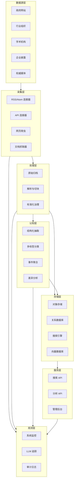
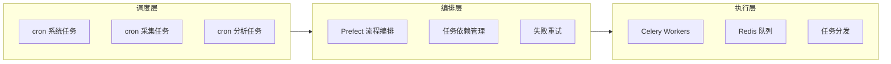
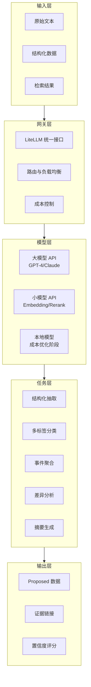
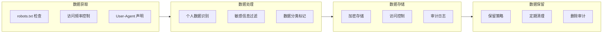
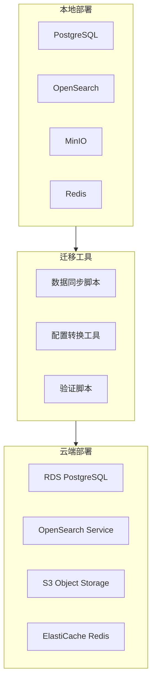
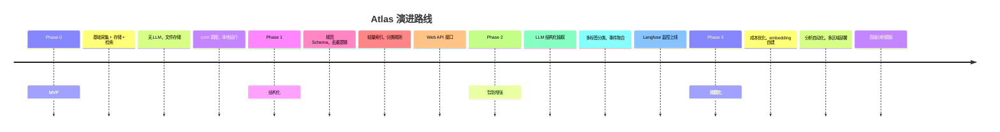

# Atlas 技术架构文档

> 基于 Atlas 技术与合规实施准则和架构决策，本文档提供分级演进的技术架构设计，支持从 MVP 到 Scale 的平滑迁移。

---

## 1. 分级架构总览

### 1.1 架构演进策略

Atlas 采用**分级架构演进**策略，根据日新增文档数量动态调整技术栈，确保从简单到复杂的平滑迁移，避免数据丢失。

| 级别 | 日新增文档数 | 存储方案 | 数据库 | 检索 | 任务调度 | LLM 处理 |
|------|-------------|----------|---------|------|----------|----------|
| **MVP** | < 100 | JSON 文件 | SQLite | FTS5 | cron 直调 | 本地模型 |
| **Growth** | 100-1000 | JSON + MinIO | SQLite/PG | FTS5/OpenSearch | cron + 简单队列 | 本地+API |
| **Scale** | > 1000 | MinIO/S3 | PostgreSQL | OpenSearch | Prefect+Celery | 混合策略 |

### 1.2 系统定位

Atlas 是一个长期运行的个人信息聚合与分析系统，具备以下特征：

- **数据源驱动**：从公开可访问的多行业信息源持续采集
- **分层处理**：原始数据 → 结构化 → 语义增强 → 分析输出
- **Local-first**：优先本地运行，支持云端迁移
- **LLM 协同**：大模型低频高价值，小模型高频轻计算
- **渐进演进**：从简单到复杂，保持数据可迁移性

### 1.3 技术栈约束

必须遵循的技术选型：

```yaml
Runtime:
  Python: "3.13.x"
  OS: "Linux (Fedora/Ubuntu compatible)"

Dependency Management:
  tool: "uv"
  principle: "最小化、显式声明"

Task Scheduling:
  primary: "cron / cron-like"
  requirements:
    - 幂等性
    - 可重试性
    - 完整日志

Core Philosophy:
  - 工程可持续性 > 可迁移性 > 可审计性 > 性能
  - 简单优先：脚本 > 服务，标准库 > 第三方
  - 显式优于隐式：配置文件 > 魔法参数
  - 分级演进：MVP → Growth → Scale
```

---

## 2. 逻辑架构设计

### 2.1 分层架构图



### 2.2 核心模块边界

| 模块 | 职责 | 产出 | 约束 |
|------|------|------|------|
| Source Registry | 信息源资产管理 | sources.json, watchlists | 可配置、可扩展 |
| Ingestion | 数据采集 | raw_documents | 不做判断、幂等 |
| Raw Archive | 原文归档 | 对象存储文件 | 不可变、可追溯 |
| Parse | 解析切块 | parsed_chunks | 可重复、可重建 |
| Governance | 标准化治理 | normalized_records | 口径中枢、质量控 |
| LLM Cognition | 认知增强 | proposed_* | 建议态、带证据 |
| Index | 检索索引 | 可重建索引 | 非事实唯一源 |
| Analytics | 分析计算 | analysis_outputs | 模板化、可解释 |

---

## 3. 数据架构设计

### 3.1 数据分层模型

```python
# 数据可信度分层
DATA_LAYERS = {
    "Raw": {
        "description": "原文与附件（不可变）",
        "storage": "object_storage",
        "immutability": True,
        "retention": "permanent"
    },
    "Proposed": {
        "description": "LLM 输出（建议态）",
        "storage": "database",
        "immutability": False,
        "evidence_required": True
    },
    "Confirmed": {
        "description": "规则/人工确认（可信态）",
        "storage": "database",
        "immutability": True,
        "access_priority": "default"
    }
}
```

### 3.2 核心数据模型

```python
# 标准化记录模型
class NormalizedRecord:
    id: str                    # 全局唯一标识
    source_id: str            # 来源标识
    raw_hash: str             # 原文指纹
    title: str                # 标题
    content: str              # 清理后内容
    metadata: dict            # 结构化元数据
    entities: List[Entity]    # 实体链接
    quality_flags: dict       # 质量标记
    created_at: datetime
    updated_at: datetime

class Entity:
    type: str                 # 实体类型（组织/人物/地点）
    name: str                 # 实体名称
    confidence: float         # 置信度
    evidence: str             # 证据位置

class LLMRun:
    id: str                   # 运行ID
    task_type: str            # 任务类型
    input_hash: str           # 输入指纹
    output_hash: str          # 输出指纹
    model: str                # 使用的模型
    cost: float               # 成本
    latency: float            # 延迟
    evidence_links: list      # 证据链接
```

### 3.3 存储策略

```yaml
Storage_Strategy:
  Object_Storage:
    purpose: "原文与附件存储"
    format: "原始格式"
    retention: "永久"
    access: "低频"
    recommendation: "MinIO/云对象存储"

  Relational_Database:
    purpose: "结构化数据存储"
    engine: "PostgreSQL 16 + pgvector"
    features:
      - "ACID 事务"
      - "向量搜索"
      - "JSON 支持"
    recommendation: "本地 PostgreSQL，云端 RDS"

  Search_Engine:
    purpose: "全文检索"
    engine: "OpenSearch"
    features:
      - "多语言支持"
      - "聚合分析"
      - "近实时搜索"
    recommendation: "单节点起步"
```

---

## 4. 任务调度架构

### 4.1 调度层次



### 4.2 任务分类

```python
TASK_CATEGORIES = {
    "collection": {
        "frequency": "hourly/daily",
        "priority": "high",
        "retry_policy": "exponential_backoff",
        "timeout": 300
    },
    "processing": {
        "frequency": "batch/triggered",
        "priority": "medium",
        "retry_policy": "fixed_delay",
        "timeout": 600
    },
    "llm_enhancement": {
        "frequency": "daily/weekly",
        "priority": "low",
        "retry_policy": "linear_backoff",
        "timeout": 1800,
        "cost_limit": "daily_quota"
    },
    "maintenance": {
        "frequency": "weekly/monthly",
        "priority": "low",
        "retry_policy": "manual",
        "timeout": 3600
    }
}
```

---

## 5. LLM 接入架构

### 5.1 LLM 使用策略



### 5.2 模型选择矩阵

| 任务类型 | 模型选择 | 频率 | 成本敏感度 | 质量要求 |
|---------|----------|------|-----------|----------|
| 结构化抽取 | GPT-4/Claude | 低频 | 中 | 高 |
| 多标签分类 | 小模型 API | 高频 | 高 | 中 |
| 事件聚合 | GPT-4 + 规则 | 中频 | 中 | 高 |
| 版本差异 | GPT-4 | 低频 | 低 | 高 |
| Embedding | 小模型 | 高频 | 高 | 中 |
| Rerank | bge-reranker | 中频 | 高 | 中高 |

### 5.3 成本控制机制

```python
# 成本控制配置
COST_CONTROL = {
    "daily_budget": 10.0,           # 日预算（美元）
    "task_limits": {
        "extraction": 100,          # 日抽取任务数上限
        "classification": 1000,     # 日分类任务数上限
        "embedding": 10000          # 日嵌入任务数上限
    },
    "fallback_strategies": {
        "budget_exceeded": "queue_tasks",
        "api_failure": "local_rules",
        "timeout": "simplify_task"
    }
}
```

---

## 6. 合规与安全架构

### 6.1 合规检查点



### 6.2 安全措施

```yaml
Security_Measures:
  Data_Acquisition:
    - rate_limiting: "1 req/sec per domain"
    - respect_robots: "always"
    - user_agent: "Atlas/{version} (contact info)"

  Data_Storage:
    - encryption: "AES-256 at rest"
    - backup: "daily encrypted backup"
    - access_control: "role-based"

  Model_Calls:
    - api_key_rotation: "monthly"
    - call_auditing: "full logging"
    - cost_monitoring: "real-time"

  Compliance:
    - data_classification: "public/internal"
    - retention_policy: "7 years default"
    - audit_trail: "immutable"
```

---

## 7. 部署架构

### 7.1 本地优先部署

```yaml
Local_Deployment:
  Min_Requirements:
    cpu: "4 cores"
    memory: "16GB"
    storage: "500GB SSD"
    network: "stable internet"

  Components:
    - "Python 3.13 + uv"
    - "PostgreSQL 16"
    - "Redis"
    - "OpenSearch (单节点)"
    - "MinIO (可选)"

  Configuration:
    env_file: ".env.local"
    data_dir: "./data"
    log_dir: "./logs"

  Startup:
    - "docker-compose up -d"  # 基础服务
    - "uv run python -m atlas.cli start"  # 主程序
```

### 7.2 云端迁移路径



### 7.3 混合部署选项

```python
HYBRID_OPTIONS = {
    "data_local_compute_cloud": {
        "description": "数据本地，计算云端",
        "use_case": "隐私要求高，计算需求波动",
        "implementation": "本地存储 + 云端 LLM API"
    },
    "cache_local_master_cloud": {
        "description": "缓存本地，主库云端",
        "use_case": "多节点协作，离线容灾",
        "implementation": "云端主库 + 本地缓存"
    },
    "edge_processing": {
        "description": "边缘预处理，云端聚合",
        "use_case": "分布式采集，中央分析",
        "implementation": "多边缘节点 + 云端聚合"
    }
}
```

---

## 8. 监控与运维架构

### 8.1 可观测性栈

```yaml
Observability_Stack:
  Metrics:
    - "Prometheus: 指标收集"
    - "Grafana: 可视化仪表板"
    - "custom_exporters: 业务指标"

  Logging:
    - "structured_logging: JSON 格式"
    - "log_levels: DEBUG/INFO/WARN/ERROR"
    - "centralized: OpenSearch/Loki"

  Tracing:
    - "Langfuse: LLM 调用追踪"
    - "correlation_ids: 请求链路"
    - "performance_metrics: 延迟分析"

  Alerting:
    - "threshold_based: 成本/性能/错误率"
    - "anomaly_detection: 数据质量异常"
    - "notification: 邮件/Slack"
```

### 8.2 关键指标监控

```python
KEY_METRICS = {
    "data_quality": {
        "duplicate_rate": "< 5%",
        "parsing_success_rate": "> 95%",
        "entity_extraction_accuracy": "> 90%"
    },
    "system_health": {
        "collection_success_rate": "> 98%",
        "api_response_time": "< 2s",
        "storage_utilization": "< 80%"
    },
    "llm_performance": {
        "daily_cost": "< $10",
        "task_success_rate": "> 95%",
        "average_latency": "< 30s"
    },
    "compliance": {
        "robots_txt_compliance": "100%",
        "rate_limiting_violations": "0",
        "data_retention_compliance": "100%"
    }
}
```

---

## 9. 演进路线图

### 9.1 实施阶段



### 9.2 技术债务管理

```yaml
Debt_Management_Strategy:
  Documentation:
    - "API 文档自动生成"
    - "架构决策记录 (ADR)"
    - "运维手册维护"

  Testing:
    - "单元测试覆盖率 > 80%"
    - "集成测试关键路径"
    - "性能回归测试"

  Code_Quality:
    - "静态分析 (ruff/mypy)"
    - "依赖安全扫描"
    - "定期重构计划"

  Technical_Risks:
    - "LLM API 依赖"
    - "数据增长规模"
    - "合规要求变化"
    - "维护资源投入"
```

---

## 10. 架构原则与约束

### 10.1 设计原则

1. **简单优先**：能脚本解决不做服务，能标准库解决不引入第三方
2. **显式优于隐式**：配置文件 > 魔法参数，明确输入输出
3. **Local-first**：本地运行第一优先，不强行绑定云厂商
4. **可审计性**：任何结论必须能回到原文，保留完整证据链
5. **可扩展性**：新增行业不等于重构系统

### 10.2 技术约束

```python
TECHNICAL_CONSTRAINTS = {
    "runtime": {
        "python_version": "3.13.x",
        "os_compatibility": ["fedora", "ubuntu"],
        "dependency_manager": "uv"
    },
    "deployment": {
        "primary_mode": "local",
        "cloud_migration": "supported",
        "containerization": "optional"
    },
    "storage": {
        "local_first": True,
        "cloud_fallback": "supported",
        "encryption": "required"
    },
    "llm_usage": {
        "cost_control": "mandatory",
        "fallback_mechanisms": "required",
        "auditing": "full_logging"
    }
}
```

---

## 11. 风险评估与缓解

### 11.1 技术风险

| 风险项 | 影响程度 | 发生概率 | 缓解措施 |
|--------|----------|----------|----------|
| LLM API 不可用 | 高 | 中 | 多供应商 + 本地降级 |
| 数据量超预期 | 中 | 中 | 存储分层 + 清理策略 |
| 合规要求变化 | 高 | 低 | 模块化设计 + 快速适配 |
| 维护资源不足 | 高 | 中 | 自动化运维 + 文档完善 |

### 11.2 业务风险

```yaml
Business_Risks:
  Data_Source_Changes:
    risk: "目标网站结构变化"
    impact: "采集失败"
    mitigation:
      - "连接器抽象层"
      - "监控告警"
      - "快速适配机制"

  Cost_Overrun:
    risk: "LLM 调用成本超预算"
    impact: "项目可持续性"
    mitigation:
      - "严格成本控制"
      - "任务优先级管理"
      - "本地模型降级"

  Compliance_Violation:
    risk: "违反网站使用条款"
    impact: "法律风险"
    mitigation:
      - "严格的 robots.txt 遵守"
      - "访问频率控制"
      - "合规性审查"
```

---

## 12. MVP 实施指南

### 12.1 MVP 核心组件（奥卡姆剃刀原则）

```yaml
MVP_Components:
  Core_Stack:
    - Python 3.13 + uv
    - SQLite (数据库)
    - JSON 文件存储
    - cron 调度

  Data_Processing:
    - requests (HTTP 客户端)
    - beautifulsoup4 (HTML 解析)
    - SQLite FTS5 (全文检索)
    - 本地 LLM (Ollama + Qwen2.5-7B)

  Utilities:
    - loguru (日志)
    - pydantic (数据验证)
    - click (CLI)

  Explicit_Excluded:
    - Redis (暂不需要)
    - Celery/Prefect (过度设计)
    - OpenSearch (SQLite FTS5 足够)
    - Docker (增加复杂度)
```

### 12.2 MVP 项目结构

```
atlas/
├── src/
│   ├── core/
│   │   ├── config.py          # 配置管理
│   │   ├── database.py        # SQLite 操作
│   │   └── storage.py         # JSON 文件存储
│   ├── collectors/
│   │   ├── base.py           # 基础采集器
│   │   └── rss.py            # RSS 采集器
│   ├── processors/
│   │   ├── parser.py         # 内容解析
│   │   └── dedup.py          # LLM 去重
│   ├── llm/
│   │   └── local_client.py   # 本地 LLM 客户端
│   └── cli.py                # 命令行接口
├── data/                     # JSON 文件存储
│   ├── raw/
│   ├── processed/
│   └── indexes/
├── config/
│   └── sources.yaml          # 数据源配置
├── logs/
├── scripts/
│   └── cron_job.py           # cron 调度脚本
├── pyproject.toml
└── README.md
```

### 12.3 采集策略实施

**频率控制**：
- 同一域名每 5 分钟不超过 1 次采集
- 支持动态调整采集频率
- LLM 队列过长时自动降速

**User-Agent 策略**：
```
Atlas/0.1.0 (Information Aggregation System; contact: your-email@example.com)
```

**错误处理**：
- 结构化错误日志
- 数据源健康监控
- 简单重试机制

### 12.4 验收标准

✅ **稳定运行**：连续 24 小时无崩溃
✅ **有效采集**：成功采集到用户认可的有效信息
✅ **去重效果**：重复内容识别准确率 > 80%
✅ **资源控制**：内存使用 < 2GB，CPU 使用 < 50%

---

## 13. 数据迁移保证

### 13.1 迁移路径设计

```python
MIGRATION_PATHS = {
    "sqlite_to_postgres": {
        "tool": "pgloader",
        "data_integrity": "checksum_validation",
        "downtime": "near_zero"
    },
    "json_to_minio": {
        "tool": "custom_sync",
        "incremental": True,
        "fallback": "keep_json_backup"
    },
    "fts_to_opensearch": {
        "tool": "bulk_reindex",
        "parallel": True,
        "validation": "sample_comparison"
    }
}
```

### 13.2 架构升级触发条件

| 组件 | 触发条件 | 升级动作 | 预计时间 |
|------|----------|----------|----------|
| 数据库 | 文档数 > 50,000 | 迁移到 PostgreSQL | 3-6 个月 |
| 搜索 | 查询延迟 > 2s | 部署 OpenSearch | 6-12 个月 |
| 队列 | 队列长度 > 1,000 | 实现 Celery | 6-9 个月 |

---

## 14. 总结

Atlas 的技术架构围绕**分级演进和长期可持续性**设计，通过 MVP → Growth → Scale 的渐进式演进，构建一个既满足当前需求又支持未来扩展的信息聚合系统。

**核心优势**：
- **分级演进**：从简单到复杂，确保数据可迁移性
- **奥卡姆剃刀**：MVP 精简高效，避免过度设计
- **本地优先**：本地 LLM + 简单队列，支持降速控制
- **渐进完善**：错误处理、数据治理逐步完善
- **用户驱动**：以稳定运行和有效信息采集为验收标准

**成功关键**：
- 严格遵守分级演进策略
- 保持 MVP 的简洁性
- 重视数据安全和可迁移性
- 建立良好的监控和日志习惯
- 根据实际使用情况调整架构

**实施建议**：
1. 先实现 MVP 核心功能（1-2 周）
2. 集成本地 LLM 和队列机制（1 周）
3. 验证与优化（1 周）
4. 根据使用情况决定升级时机

> Atlas 的目标不是构建最先进的技术系统，而是构建**最可靠、最可维护、最适合长期运行**的信息基础设施。分级演进策略确保系统始终保持简洁和高效。